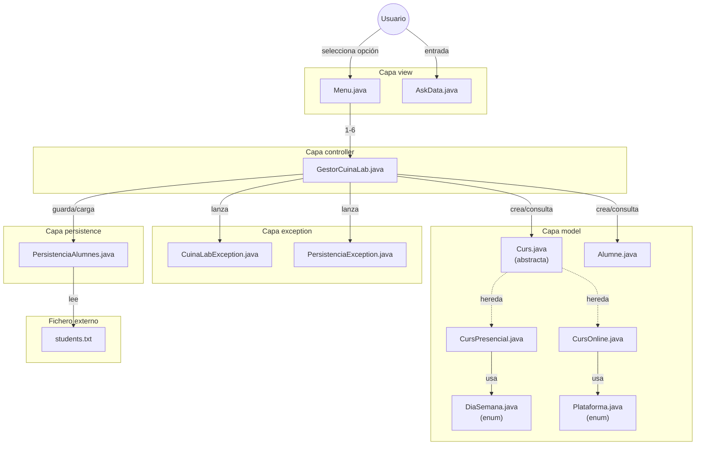
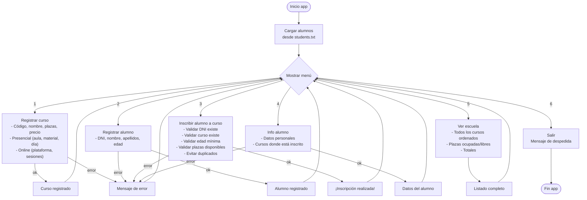

# Java Maven Template — MVC + Persistencia CSV

Template genérico de proyecto Java con Maven, arquitectura MVC,
excepciones propias, persistencia en CSV y validaciones comunes.

Incluye un proyecto de ejemplo completo: **CuinaLab - Escuela de Cocina**
(un sistema de gestión de cursos y alumnos).

---

## Diagrama de arquitectura del sistema



## Diagrama de flujo del menú



---

## Estructura del proyecto

```
src/main/java/com/cuinalab/app/
├── CuinaLab.java              → Clase principal (main)
├── controller/
│   └── GestorCuinaLab.java    → Lógica de negocio
├── exception/
│   ├── CuinaLabException.java      → Errores de lógica
│   └── PersistenciaException.java  → Errores de ficheros
├── model/
│   ├── Alumne.java            → Entidad alumno
│   ├── Curs.java              → Clase abstracta curso
│   ├── CursOnline.java        → Curso online (hereda)
│   ├── CursPresencial.java    → Curso presencial (hereda)
│   ├── DiaSemana.java         → Enum LUNES..VIERNES
│   └── Plataforma.java        → Enum ZOOM, MEET, TEAMS
├── persistence/
│   └── PersistenciaAlumnes.java → Lectura CSV
└── view/
    ├── AskData.java           → Entrada validada por consola
    └── Menu.java              → Menú interactivo
src/main/resources/            → Recursos adicionales
src/test/java/                 → Tests unitarios
students.txt                   → Datos de alumnos (CSV)
```

### Descripción de cada capa

| Capa | Contenido |
|---|---|
| `model/` | Clases del dominio: `Curs` (abstracta), `CursPresencial`, `CursOnline`, `Alumne`, enums `DiaSemana` y `Plataforma`. |
| `controller/` | `GestorCuinaLab` orquesta la lógica de negocio: alta de cursos/alumnos, inscripciones, consultas. |
| `view/` | `Menu` con bucle `do-while` y 6 opciones. `AskData` valida entrada de enteros, decimales, cadenas y booleanos. |
| `persistence/` | `PersistenciaAlumnes` lee `students.txt` en formato CSV al arrancar (solo lectura). |
| `exception/` | `CuinaLabException` para errores de negocio. `PersistenciaException` para errores de E/S. |

---

## Funcionalidades

La aplicación ofrece un menú con 6 opciones:

1. **Registrar curso** — crea un curso (presencial u online) con validaciones de código único, capacidad 5-20, precio positivo
2. **Registrar alumno** — da de alta un alumno con DNI único, nombre, apellidos y edad 16-99
3. **Inscribir alumno a curso** — valida existencia, plazas libres, edad mínima (menores 18 solo presencial), sin duplicados
4. **Info alumno** — muestra datos personales y cursos inscritos
5. **Ver escuela** — lista todos los cursos ordenados por código con plazas ocupadas/libres y totales
6. **Salir** — cierra la aplicación

---

## Cómo adaptarlo a un proyecto nuevo

### 1. Clonar o copiar

```bash
git clone <repo> mi-nuevo-proyecto
cd mi-nuevo-proyecto
```

### 2. Renombrar el package base

```bash
# Ejemplo: cambiar de com.cuinalab.app a com.miclub.gestion
mkdir -p src/main/java/com/miclub/gestion
mv src/main/java/com/cuinalab/app/controller src/main/java/com/miclub/gestion/
mv src/main/java/com/cuinalab/app/exception src/main/java/com/miclub/gestion/
mv src/main/java/com/cuinalab/app/model src/main/java/com/miclub/gestion/
mv src/main/java/com/cuinalab/app/persistence src/main/java/com/miclub/gestion/
mv src/main/java/com/cuinalab/app/view src/main/java/com/miclub/gestion/
mv src/main/java/com/cuinalab/app/CuinaLab.java src/main/java/com/miclub/gestion/
rm -rf src/main/java/com/cuinalab

# Lo mismo para test
mkdir -p src/test/java/com/miclub/gestion
mv src/test/java/com/cuinalab/app/* src/test/java/com/miclub/gestion/
rm -rf src/test/java/com/cuinalab
```

### 3. Actualizar `pom.xml`

```xml
<groupId>com.miclub</groupId>
<artifactId>gestion-club</artifactId>
<exec.mainClass>com.miclub.gestion.Main</exec.mainClass>
```

### 4. Renombrar la clase principal

```bash
mv src/main/java/com/miclub/gestion/CuinaLab.java src/main/java/com/miclub/gestion/Main.java
```

Y ajustar el nombre de clase dentro del fichero.

### 5. (Opcional) Renombrar el directorio raíz

```bash
cd ..
mv java-maven-template mi-nuevo-proyecto
cd mi-nuevo-proyecto
```

---

## Convenciones del proyecto

| Aspecto | Convención |
|---|---|
| **Idioma** | Español, catalán o inglés, pero **consistente** en todo el código |
| **Nombres** | Descriptivos, camelCase (variables/métodos) y PascalCase (clases) |
| **Colecciones** | `HashMap` para búsquedas por clave, `TreeMap` para ordenación, `ArrayList` para listas. Cada uso justificado con comentario. |
| **Excepciones** | Propias, extendiendo `Exception`, una por ámbito de error |
| **Persistencia** | CSV con `BufferedReader`/`BufferedWriter` y captura de `IOException` envuelta en `PersistenciaException` |
| **Herencia** | Clase abstracta base con hijas concretas que sobrescriben métodos abstractos |
| **Bucles** | Solo `do-while` y `for`. Prohibido: `break` (excepto switch), `continue`, `exit`, bucles infinitos |
| **Lambdas** | No permitidas (no vistas en clase) |

---

## Dependencias

Ninguna. Proyecto Java base sin frameworks externos.
Solo JDK 21+ y Maven.

```bash
mvn clean compile exec:java
```
